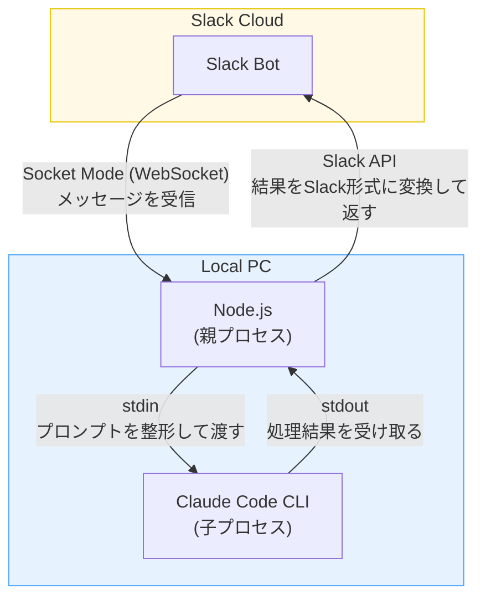

# Claude Code Slack Bridge

> **Beta版です。** バグがある可能性があります。見つけた場合は適宜修正していきますのでご了承ください。

SlackのDMから、自分のPCのClaude Code CLIを直接操作できるツールです。
つまり**スマホから自分のClaude Code CLIが使えます**。PCを開けないとき——旅行中、散歩中、満員電車の中など、あらゆる外出先からコードの調査・修正・生成を指示できます。

## セットアップ
Claude Codeでこのプロジェクトを開いて、「**セットアップして**」と言ってください。
対話形式でインストールと設定ファイルの生成が完了します。

## 使い方

### 1. ホームタブでモデルと作業ディレクトリを選ぶ
ボットのホームタブを開いて、**モデル**（Opus / Sonnet / Haiku）と**作業ディレクトリ**をドロップダウンから選びます。作業ディレクトリはClaude Codeのプロジェクト一覧から自動取得されます。

### 2. メッセージタブでプロンプトを送る
ボットの「メッセージ」タブを開いて、テキストを送ってください。AIがスレッドで返信します。

### 3. リアクションで進捗を確認する
送ったメッセージにリアクションが自動でつきます。

| リアクション | 意味 |
|:---:|---|
| ⏳ | Slackのメッセージをローカルの親プロセス（Node.js）が受け取って、子プロセス（Claude CLI）にプロンプトを渡す準備をしています |
| 🧠 | Claude CLIがプロンプトを受け取って処理を実行しています |
| ✅ | 処理が完了しました |

### 4. 処理を中断したいとき
🧠がついている自分のメッセージに 🔴 リアクション（「あか」と入力すると出てきます）をつけると、処理がストップします。

## 注意事項
- **1スレッド = 1セッション** スレッド間でコンテキストは分断されているので、別のスレッドで「さっきのスレッドで言ったことについて検討して」と言ってもAIには理解できません。新しいDMを送ると新しいスレッド（＝新しいセッション）が始まります。
- **ファイル・画像の添付は未対応です。** 必ずテキストだけ送ってください。
- **Permission modeは最強設定です。** 常に bypass permissions on になっているイメージです。Slack経由では承認/拒否の対話ができないため、仕様上こうなっています。気をつけてください。
- **スラッシュコマンドは使えません。** Slack上で `/コマンド` を打つとSlack側のコマンドとして解釈されてエラーになります。カスタムコマンドは検討中でまだ対応していません。スキルを使いたい場合は「superpowersのbrainstormingスキルを使って」のようにテキストで指示してください。
- **PCがスリープするとプロセスが止まるので工夫します。** launchdでの起動時は `caffeinate -i` 経由で実行されるため、電源種別（AC/バッテリー）を問わずアイドルスリープが防止されます（蓋を閉じるとスリープされます）。蓋を閉じた状態でも使いたい場合は `sudo pmset -a disablesleep 1` が必要です。これはシステム設定の変更なので、不要になったら `sudo pmset -a disablesleep 0` で手動で戻してください。私の場合は電車でPCを閉じてカバンに入れたまま使いたい、といった場面が多いので、この設定を常用しています。

## 今後の対応予定
- カスタムスラッシュコマンド
- チャンネルへの追加
- Wi-Fi切り替え時の自動再接続 — macOSの`scutil`でネットワーク変化を検知し、WiFi復帰時にBridgeを自動再起動で対応済み（2026-03-19）
- localhostをBridge起動PC外（スマホなど）から閲覧可能にする — cloudflaredトンネル経由でlocalhostのリンクをSlack用リンクへ自動変換で対応済み（2026-03-19）

## 既知の制限事項
- **CLIのPIDに依存するスクリプトから起動されたlocalhostサーバーはBridge経由では動作しません。** 例えばsuperpowersのbrainstormingスキルの「Visual Companion」は、CLIプロセスのPIDを監視して親が死んだらサーバーも自動停止する仕組みを持っています。Bridge環境ではCLIのプロセス階層が通常のターミナル使用と異なるため、サーバーが1〜2分で自動停止してしまい、Cloudflareトンネル経由でアクセスすると502エラーになります。`npx serve` や `python3 -m http.server` など、PID監視を持たない通常のサーバーで立てたlocalhostは問題なくトンネル経由でアクセスできます。

## 仕組み

ローカルPCで立ち上げたNode.jsプロセス（親プロセス）が、Socket ModeでSlackと繋がっています。Slackから来たメッセージを整形して、Claude Code CLIの子プロセスにstdinで渡します。この結果はstdoutでNode.jsプロセス（親プロセス）に返ってくるので、Slackで表示できる形に変換してAPIで投稿します。

- 親プロセスはmacOS標準のlaunchdデーモンとして動作させています。なので、ログイン時に自動起動し、クラッシュ時も自動で再起動されます。`caffeinate -i` 経由で実行されるため、PCがアイドルスリープすることもありません。つまり、ユーザーがPCの電源をONにしている間は常にSlackから使えるようになります。
- 子プロセスのClaude Code CLIは`claude -p`コマンドで立ち上げます。このコマンドは非対話モードを指定するコマンドで、stdin/stdoutでClaude Code CLIを使えます。
