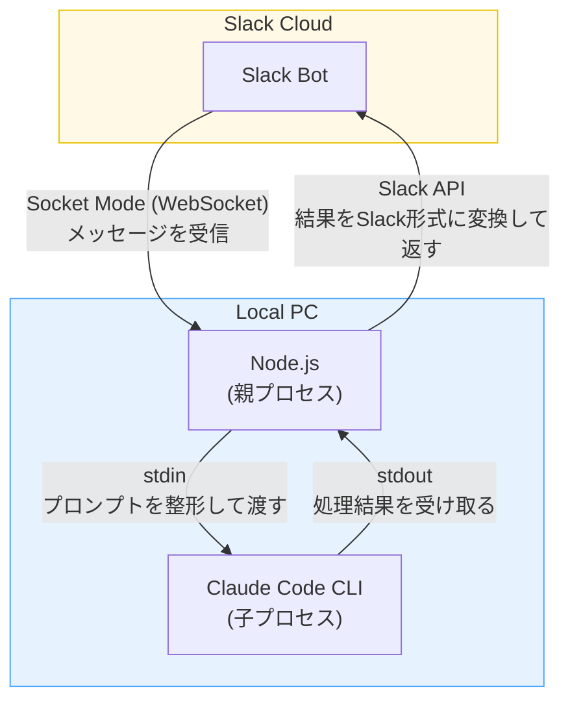

# Claude Code Slack Bridge

> **Beta版です。** バグがある可能性があります。見つけた場合は適宜修正していきますのでご了承ください。

SlackのDMから、自分のPCのClaude Code CLIを直接操作できるツールです。
つまり**スマホから自分のClaude Code CLIが使えます**。PCを開けないとき——旅行中、散歩中、満員電車の中など、あらゆる外出先からコードの調査・修正・生成を指示できます。

## セットアップ
Claude Codeでこのプロジェクトを開いて、「**セットアップして**」と言ってください。
対話形式でインストールと設定ファイルの生成が完了します。

## 使い方

### 起動する
Claude Codeでこのプロジェクトを開いて、「**プロセスを起動して**」と指示してください。Claude Codeが起動処理を行います。手動で `npx tsx src/index.ts` を実行しても起動できますが、Claude Code CLIのバージョン不一致でエラーになることがあるため、Claude Codeに任せることを推奨します（バージョン不一致を自動で検知・修正するスキルが組み込まれています）。

### Slackで使う

#### 1. ホームタブでモデルと作業ディレクトリを選ぶ
ボットのホームタブを開いて、**モデル**（Opus / Sonnet / Haiku）と**作業ディレクトリ**をドロップダウンから選びます。作業ディレクトリはClaude Codeのプロジェクト一覧から自動取得されます。

#### 2. メッセージタブでプロンプトを送る
ボットの「メッセージ」タブを開いて、テキストを送ってください。AIがスレッドで返信します。

#### 3. リアクションで進捗を確認する
送ったメッセージにリアクションが自動でつきます。

| リアクション | 意味 |
|:---:|---|
| ⏳ | Slackのメッセージをローカルの親プロセス（Node.js）が受け取って、子プロセス（Claude CLI）にプロンプトを渡す準備をしています |
| 🧠 | Claude CLIがプロンプトを受け取って処理を実行しています |
| ✅ | 処理が完了しました |

#### 4. 処理を中断したいとき
🧠がついている自分のメッセージに 🔴 リアクション（「あか」と入力すると出てきます）をつけると、処理がストップします。

## 注意事項
- **コンテキストはスレッド内で完結しています。** スレッド間でコンテキストは分断されているので、別のスレッドで「さっきのスレッドで言ったことについて検討して」と言ってもAIには理解できません。新しいDMを送ると新しいスレッド（＝新しいセッション）が始まります。
- **ファイル・画像の添付は未対応です。** 必ずテキストだけ送ってください。
- **Permission modeは最強設定です。** 常に bypass permissions on になっているイメージです。Slack経由では承認/拒否の対話ができないため、仕様上こうなっています。気をつけてください。
- **スラッシュコマンドは使えません。** Slack上で `/コマンド` を打つとSlack側のコマンドとして解釈されてエラーになります。カスタムコマンドは検討中でまだ対応していません。スキルを使いたい場合は「superpowersのbrainstormingスキルを使って」のようにテキストで指示してください。
- **PCがスリープするとプロセスが止まるので工夫します。** デフォルトでは `caffeinate -s` を使って起動するため、PCの蓋が開いた状態であればスリープが防止されます（蓋を閉じるとスリープされます）。蓋を閉じた状態でも使いたい場合は `sudo pmset -a disablesleep 1` が必要です。これはシステム設定の変更なので、不要になったら `sudo pmset -a disablesleep 0` で手動で戻してください。私の場合は電車でPCを閉じてカバンに入れたまま使いたい、といった場面が多いので、この設定を常用しています。
- **PC側のWi-Fiを切り替えるとプロセスの再起動が必要です。** SlackとPCはWebSocketで接続しているため、PC側のWi-Fiの切り替え（家のWi-Fi→テザリング、2階のWi-Fi→1階のWi-Fiなど）でIPアドレスが変わると接続が切れます。その場合はプロセスを再起動してください。スマホ側のWi-Fi切り替えは接続に影響しません（Slackのサーバーとスマホの接続はSlack側が管理しているためです）。

## 今後の対応予定
- カスタムスラッシュコマンド
- チャンネルへの追加
- Wi-Fi切り替え時の自動再接続

## 仕組み

ローカルPCで立ち上げたNode.jsプロセス（親プロセス）が、Socket ModeでSlackと繋がっています。Slackから来たメッセージを整形して、Claude Code CLIの子プロセスにstdinで渡します。この結果はstdoutでNode.jsプロセス（親プロセス）に返ってくるので、Slackで表示できる形に変換してAPIで投稿します。

※ Claude Code CLIの子プロセスは`claude -p`コマンドで立ち上げます。このコマンドは非対話モードを指定するコマンドで、stdin/stdoutでClaude Code CLIを使えます。
