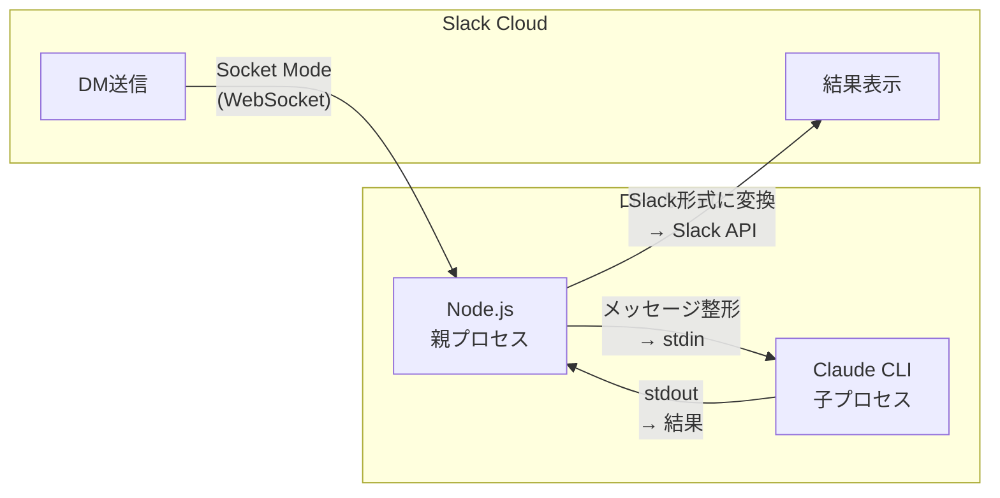

# Claude Code Slack Bridge

SlackのDMから、自分のPCで動いているClaude Code CLIを直接操作できるツールです。

つまり**スマホからClaude Codeが使えます**。PCを開けないとき——旅行中、散歩中、満員電車の中など、あらゆる外出先からコードの調査・修正・生成を指示できます。

---

## セットアップ

Claude Codeでこのプロジェクトを開いて、「**セットアップして**」と言ってください。
対話形式でインストールと設定ファイルの生成が完了します。

---

## 使い方

### 1. ホームタブで準備する

ボットのホームタブを開いて、**モデル**（Opus / Sonnet / Haiku）と**作業ディレクトリ**をドロップダウンから選びます。作業ディレクトリはClaude Codeのプロジェクト一覧から自動取得されます。

### 2. メッセージタブでプロンプトを送る

ボットにDMを送るだけです。

### 3. リアクションで進捗を確認する

送ったメッセージにリアクションが自動でつきます。

| リアクション | 意味 |
|:---:|---|
| ⏳ | Slackのメッセージをローカルの親プロセス（Node.js）が受け取って、子プロセス（Claude CLI）にプロンプトを渡す準備をしています |
| 🧠 | Claude CLIがプロンプトを受け取って処理を実行しています |
| ✅ | 処理が完了しました |

### 4. 処理を中断したいとき

🧠がついている自分のメッセージに 🔴 リアクション（「あか」で変換すると出てきます）をつけると、処理がストップします。

---

## 注意事項

- **コンテキストはスレッド内で完結しています。** AIはあなたが立ち上げたスレッドに返信する形で回答します。スレッド間でコンテキストは分断されているので、別のスレッドで「さっきのスレッドで言ったことについて検討して」と言ってもAIには理解できません。新しいDMを送ると新しいスレッド（＝新しいセッション）が始まります
- **ファイル・画像の添付は未対応です。** 必ずテキストだけ送ってください
- **Permission modeは最強設定です。** 常に bypass permissions on になっているイメージです。Slack経由では承認/拒否の対話ができないため、仕様上こうなっています。気をつけてください
- **スラッシュコマンドは使えません。** Slack上で `/なんたら` と打つとSlack側のコマンドとして解釈されてエラーになります。カスタムコマンドは検討中でまだ対応していません。スキルを使いたい場合は「superpowersのbrainstormingスキルを使って」のようにテキストで指示してください

---

## 今後の対応予定

- カスタムスラッシュコマンド
- チャンネルへの追加

---

## 仕組み

ローカルPCで立ち上げたNode.jsプロセス（親プロセス）が、Socket ModeでSlackと繋がっています。Slackから来たメッセージを整形して、`claude -p`（stdin/stdoutでClaude CLIを使えるコマンド）の子プロセスにstdinで渡します。結果がstdoutで返ってくるので、Slackで表示できる形に変換してAPIで投稿します。
